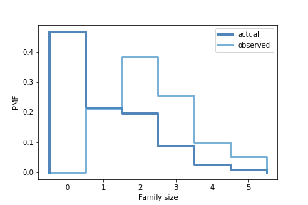

[Think Stats Chapter 3 Exercise 1](http://greenteapress.com/thinkstats2/html/thinkstats2004.html#toc31) (actual vs. biased)

>> There is  a 46.61782% actual probability of having no children in a family. However surveying children would ignore this data, as families with no children would not be represented, therefore creating a biased distribution. Mean of actual observations is 1.024205 while mean of the biased distribution is 2.403679



```python
pmf = thinkstats2.Pmf(resp.numkdhh, label='actual')
biased_pmf = BiasPmf(pmf, label='observed')

thinkplot.PrePlot(2)
thinkplot.Pmfs([pmf, biased_pmf])
thinkplot.Config(xlabel='Family size', ylabel='PMF')

print('Actual mean:%f'% pmf.Mean())
print('Biased mean:%f'% biased_pmf.Mean())
```
