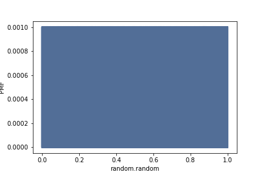
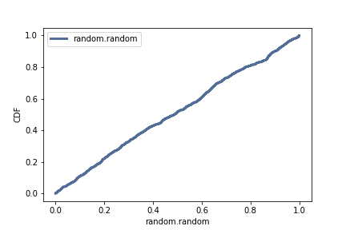

[Think Stats Chapter 4 Exercise 2](http://greenteapress.com/thinkstats2/html/thinkstats2005.html#toc41) (a random distribution)

>> By looking at the CDF, distribution seems to be uniform.

```python
import numpy as np
import nsfg
import first
import thinkstats2
import thinkplot
import matplotlib.pyplot as plt

randNumbers = [np.random.random() for i in range(1,1000)]

randNumbers_Pmf = thinkstats2.Pmf(np.asarray(randNumbers))
thinkplot.Pmf(randNumbers_Pmf)
thinkplot.Config(xlabel='random.random', ylabel='PMF')
plt.savefig('RandomNumberPMF.png')
```


```python
randNumbers_Cdf = thinkstats2.Cdf(np.asarray(randNumbers), label = 'random.random')
thinkplot.Cdf(randNumbers_Cdf)
thinkplot.Config(xlabel='random.random', ylabel='CDF')
plt.savefig('RandomNumberCDF.png')
```

